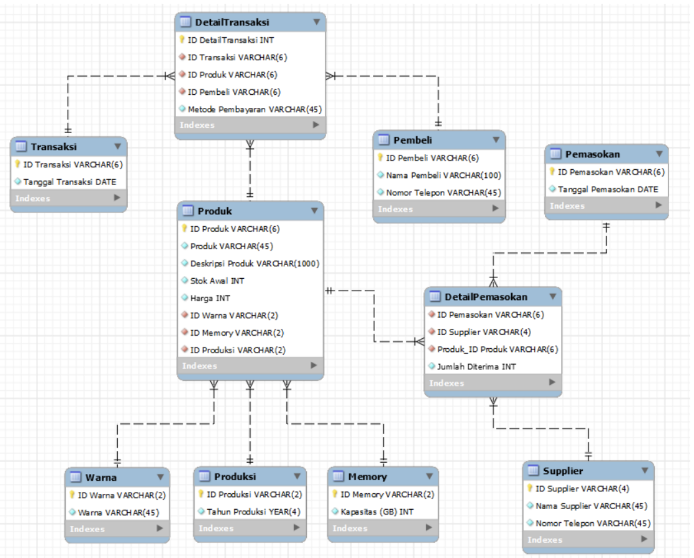

# 🍎 Apple Gadget Store Database System
*Designing and Implementing a Relational Database for Apple Gadget Sales Management*

---

## 📘 Overview
In today’s digital era, a well-structured **database system** plays a critical role in managing business operations efficiently.  
This project focuses on designing and implementing a **relational database** for **Apple Gadget Store**, a retail business specializing in Apple products such as iPhones, iPads, and MacBooks.

The database was built to improve **data management**, **sales monitoring**, and **inventory tracking**, enabling the store to provide faster, more accurate customer service and support data-driven decisions.

---

## 🎯 Background & Problem Statement
Before implementing this new system, the store faced several operational issues:
- Product data was **not organized**, making it hard to find product information quickly.
- The sales team struggled to access up-to-date stock details.
- There was **no integration** between product, supplier, and transaction data.

To address these challenges, a new, normalized database system was developed to ensure:
- Efficient product and transaction tracking  
- Automated stock updates  
- Improved reporting and customer service

---

## ⚙️ Database Objectives
- Build an **integrated data structure** to store products, customers, suppliers, and transaction details.  
- Enable **automatic stock updates** after sales and supply transactions.  
- Support **fast and accurate data retrieval** for decision-making.  
- Improve store performance and customer experience.

---

## 🧱 Database Design

### 🔹 General Overview
The database captures store activities from **January 2023 to December 2023**, focusing on inventory and transaction flow.  
It connects major entities such as **Product**, **Transaction**, **Supplier**, **Customer**, and **Stock Movement** through structured relationships.

### 🧩 Entity and Attribute Summary
| Entity | Description | Key Attributes |
|--------|--------------|----------------|
| **Warna (Color)** | Stores product color options | `ID_Warna`, `Warna` |
| **Memory** | Stores memory variations (GB) | `ID_Memory`, `Kapasitas_GB` |
| **Produksi (Production)** | Stores product production year | `ID_Produksi`, `Tahun_Produksi` |
| **Produk (Product)** | Stores main product info | `ID_Produk`, `Produk`, `Harga`, `Stok_Awal`, `ID_Warna`, `ID_Memory`, `ID_Produksi` |
| **Pembeli (Customer)** | Stores customer data | `ID_Pembeli`, `Nama_Pembeli`, `Nomor_Telepon` |
| **Supplier** | Stores supplier details | `ID_Supplier`, `Nama_Supplier`, `Nomor_Telepon` |
| **Transaksi (Transaction)** | Stores sales transaction info | `ID_Transaksi`, `Tanggal_Transaksi` |
| **DetailTransaksi** | Stores transaction details | `ID_DetailTransaksi`, `ID_Transaksi`, `ID_Produk`, `ID_Pembeli`, `Metode_Pembayaran` |
| **Pemasokan (Supply)** | Stores product supply info | `ID_Pemasokan`, `Tanggal_Pemasokan` |
| **DetailPemasokan** | Links suppliers and supplied products | `ID_Pemasokan`, `ID_Supplier`, `ID_Produk`, `Jumlah_Diterima` |

---

## 🔗 Table Relationships

### 🔹 One-to-Many
- **Pembeli → DetailTransaksi**  
  Each buyer can make multiple purchases.
- **Produk → DetailTransaksi**  
  Each product can appear in multiple transactions.
- **Transaksi → DetailTransaksi**  
  Each transaction can involve several products.
- **Supplier → DetailPemasokan**  
  One supplier can supply many products.
- **Pemasokan → DetailPemasokan**  
  One supply event can include several items.
- **Warna / Memory / Produksi → Produk**  
  Each color, memory type, or production year can link to multiple products.

### 🔹 Many-to-Many
- **Produk ↔ Pemasokan** via `DetailPemasokan`  
  Each product can be supplied multiple times, and each supply may include several products.

---

## 🧠 Logical Schema (ERD)

The ERD below illustrates the relationships among key entities such as Product, Customer, Supplier, and Transaction within the Apple Gadget Store database system.

---

## Key Benefits

- Centralized and clean data structure for all product, sales, and supplier information.  
- Real-time stock updates after each transaction or restock.  
- Improved data accessibility and service speed for staff.  
- Scalable structure for future integration with analytics or web systems.

## 📄 Documentation
FFull ERD, normalization steps, and SQL implementation can be found in:  
📘 [Apple_Gadget_Store_Database_Report](./Docs/Apple_Gadget_Store_Database_Report.pdf)

---

## 🧑‍💻 Author
**M. Iqbal Nurrifki**  
📧 [miqbalnurrifki@gmail.com]

