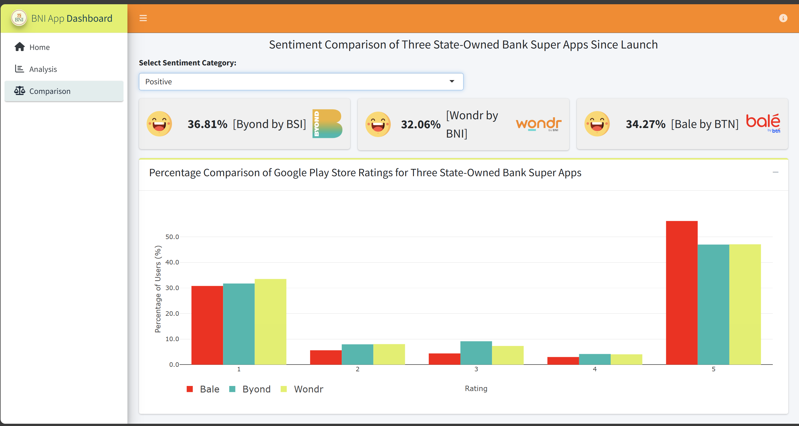

# 🏦 BNI Mobile Banking & WONDR App – Sentiment Dashboard  
*Interactive R Shiny Dashboard for Banking App Review Insights*

---

## 🔗 Launch Dashboard  
[Open the Dashboard](https://rrdash.shinyapps.io/Dashboard_BNI/)

---

## 🧭 Project Overview  
This interactive **R Shiny** dashboard visualizes and compares user sentiments between **BNI Mobile Banking** and its successor **WONDR by BNI**, using Google Play Store reviews collected over the last six months (July 5, 2024 – January 9, 2025).  

The dashboard aims to support **BNI’s digital transformation monitoring**, providing insights into customer perceptions, app performance, and transition feedback between the two applications.

---

## 📊 Dashboard Features  

- **🏠 Home Page:**  
  Introduces the objective of the analysis — comparing sentiment trends and user experiences between BNI Mobile Banking and WONDR. Includes context about BNI’s digital transition and app evolution.

- **📈 Analysis Page:**  
  Provides a deep dive into each app’s review distribution and sentiment ratio.  
  Features include:  
  - Sentiment Ratio cards for Positive, Neutral, and Negative reviews.  
  - Ratings Distribution charts (1–5 stars) for each app.  
  - **Word Clouds** showing the most frequent words by sentiment category (Positive, Neutral, Negative).  
  - **Review Explorer Table** to view most-liked reviews per rating category and analyze specific user feedback.

- **⚖️ Comparison Page:**  
  Displays a **cross-app sentiment comparison** among three Indonesian state-owned bank super apps — **Byond (BSI)**, **Wondr (BNI)**, and **Balé (BTN)**.  
  - Visualizes the percentage of positive, neutral, and negative reviews for each app.  
  - Includes a bar chart comparing Play Store ratings (1–5 stars) between apps for market benchmarking.

---

## 🧰 Tools & Technologies  
| Category             | Tools / Libraries                          |
|----------------------|---------------------------------------------|
| Programming Language | R                                           |
| Framework            | R Shiny                                     |
| Data Wrangling       | dplyr, tidyr, lubridate                    |
| Visualization        | ggplot2, plotly, wordcloud2, DT             |
| UI Styling           | shinythemes, shinydashboard, bslib          |

---

## 🧠 Key Insights  
- **WONDR App** has a higher neutral sentiment (≈ 45%) compared to BNI Mobile Banking (≈ 39%), indicating users are still adapting to the new interface.  
- **Positive sentiment** for both apps remains consistent (~32%), showing good overall reception of usability and design.  
- **Top positive keywords:** *“transaksi mudah”, “cepat mudah”*  
- **Top negative keywords:** *“verifikasi wajah”, “susah login”, “force close”*  
- Comparison with **Byond (BSI)** and **Balé (BTN)** shows that Wondr by BNI’s sentiment distribution remains competitive among state-owned bank super apps.

---

## 📸 Dashboard Preview  
| Home | Analysis | Word Cloud | Comparison |
|------|-----------|------------|-------------|
|  |  |  |  |

---

## 👤 Author
**M. Iqbal Nurrifki**    
📧 [miqbalnurrifki@gmail.com]
 
